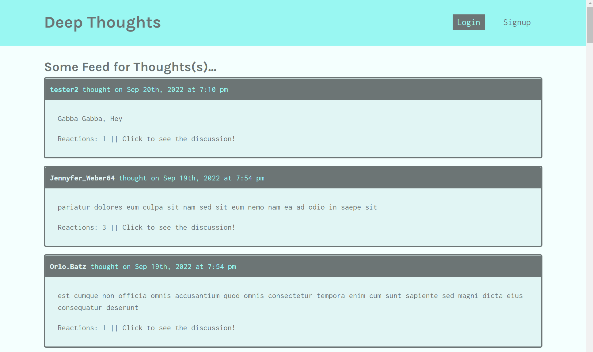

<h1 align='center'>Deep Thoughts</h1>

## Technologies 🤖

## Description

A MERN stack, social media application where users can create an account, post their thoughts, and interact with other users via their thoughts.

## Installation

* Run `npm init -y` from the command line
* Run `npm install` from the root directory to install dependencies in the root, client, and server
* Run `npm run seed` from root directory to seed the app

## Usage
* Develop
     * From the root directory, run `npm run develop`

### Made with ❤️ by  Brad Dunham

